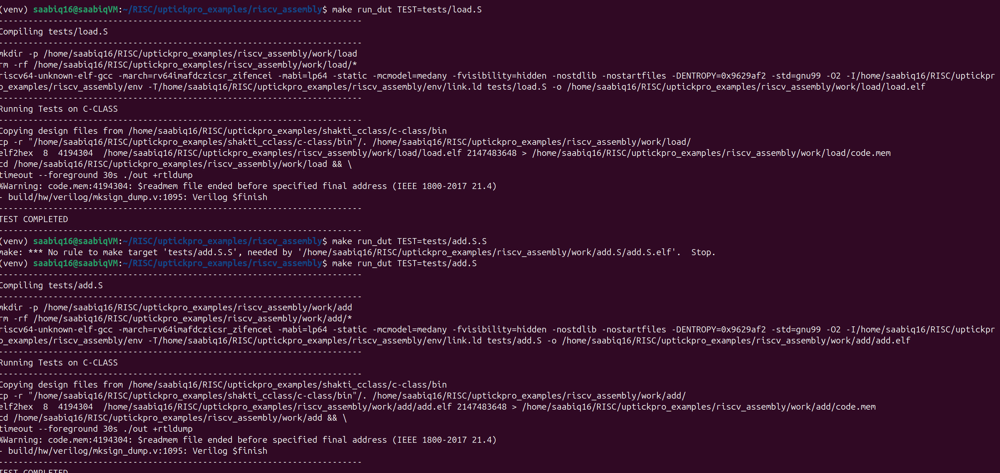

**Comment:**  
This screenshot shows the successful simulation output when the **Round-Robin (RR)** replacement

**Comment:**  
This screenshot displays the result after implementing the **Pseudo-LRU (PLRU)** policy. The simulation runs successfully, indicating correct integration of the new replacement logic in the D-Cache.
