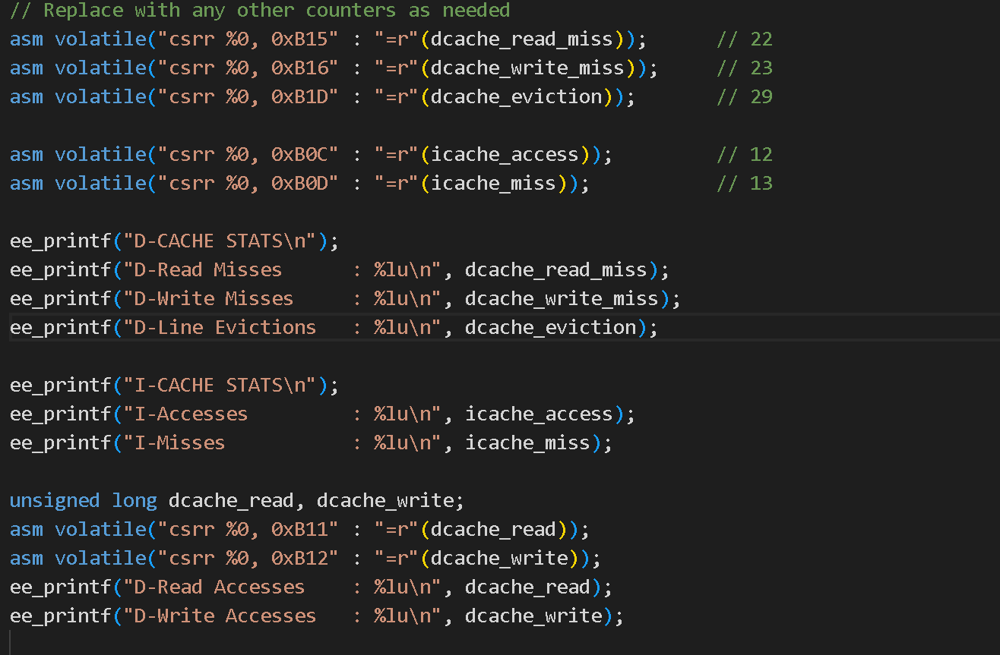
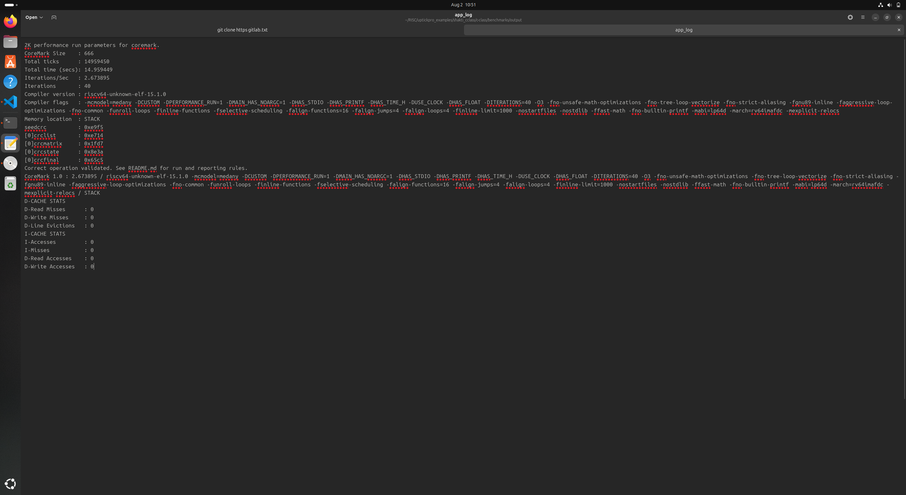
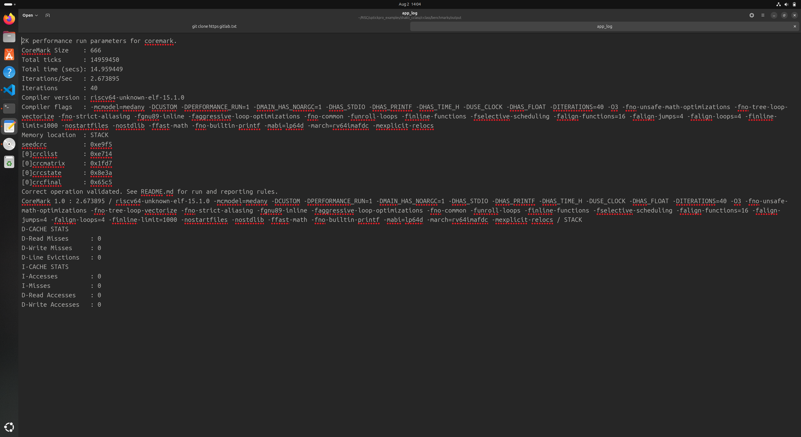
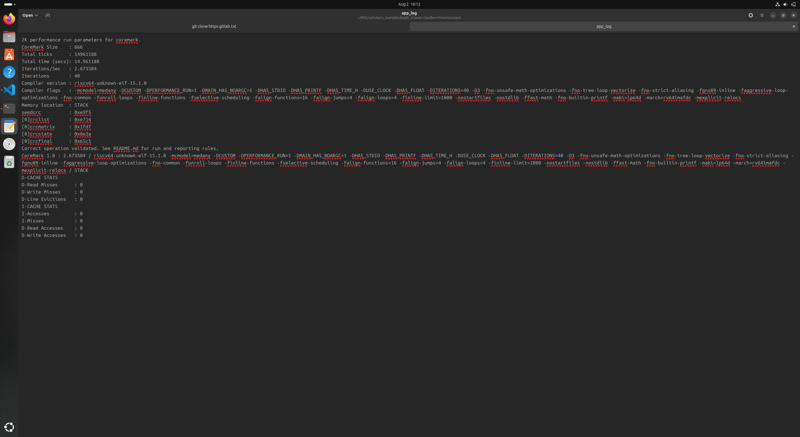
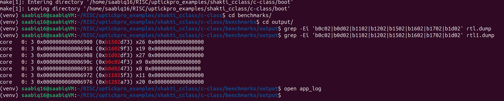

These are the lines we included in core_main.C file 

These are the output from app_log for various replacement policy

**Replacement policy : PLRU**

**Replacement policy : RR**

**Replacement policy : RANDOM**

**Replacement policy : LFU**

**Replacement policy : FIFO**

This is the corresponding values of the cache parameters in rtl1.dump for the counters I included in coremain.c 
