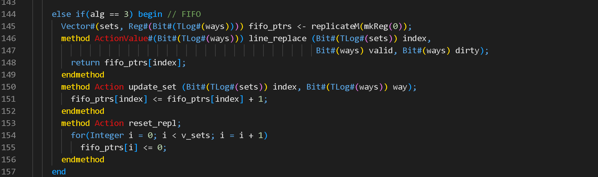
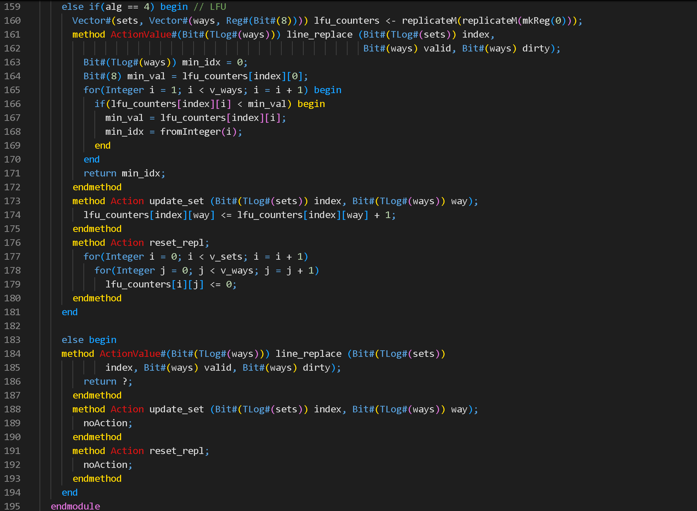
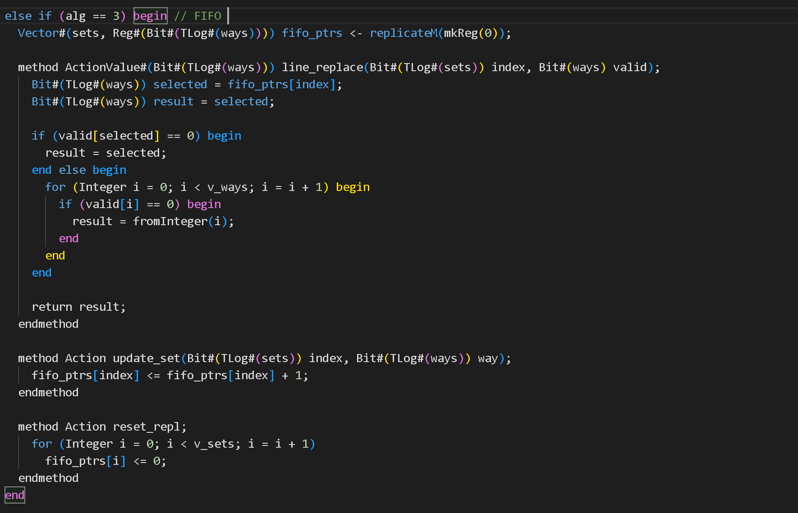
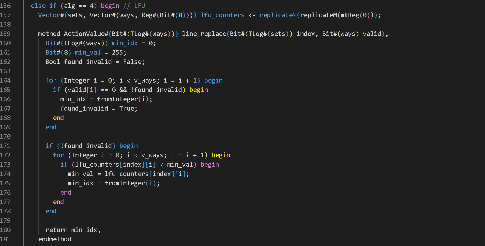

This folder contains modified replacement_dcache.bsv  and replacement_icache.bsv file

comment : This is for D-cache

comment : This is FIFO algorithm added in D-cache
            The FIFO pointer keeps track of the next cache way to be replaced and is incremented whenever a new block is inserted into the cache. In D-Cache, we directly use this pointer without checking validity, assuming all lines are valid. However, in I-Cache, we include additional logic to first prefer invalid lines before falling back to the FIFO pointer, to avoid evicting useful instructions unnecessarily.

comment : This is LFU algorithm added in D-cache

comment : This is For I cache

comment : This is the FIFO algorithm added in I-cache

comment : This is the LFU algorithm added in I-cache
